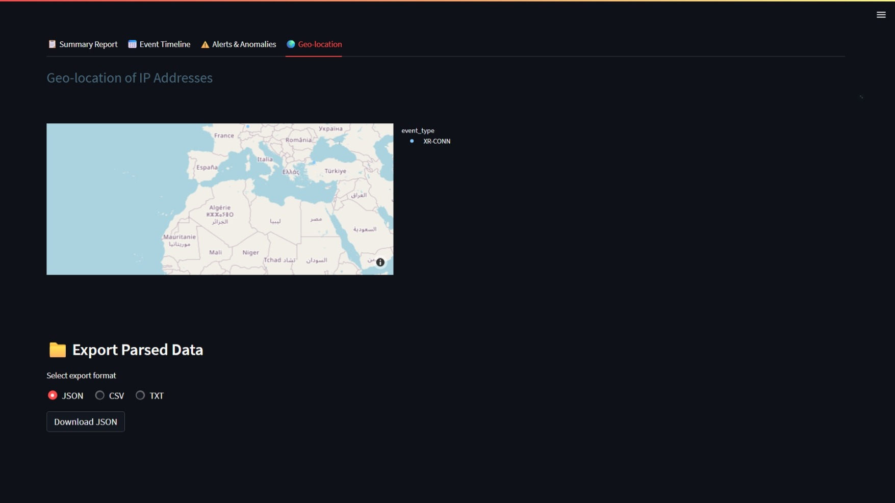

#  Forensic Artifact Parser and Analyzer for Custom Logs

A web-based forensic tool for parsing and analyzing custom log files. Built using **Streamlit**, this application enables investigators, cybersecurity analysts, and IT professionals to visually explore and detect anomalies in logs with minimal setup.

---

##  Key Features

###  Multi-format Log Input

* Accepts `.txt`, `.log`, and `.vlog` formats.
* Automatically extracts:

  * Timestamps
  * Event types (`EVNT:XR-XXXX`)
  * Usernames (`usr:username`)
  * IP addresses (`IP:xxx.xxx.xxx.xxx`)
  * File paths
  * Process IDs

###  Visual & Analytical Dashboards

* ** Summary Report**: Overview of log entries, unique users, events, and IPs.
* ** Event Timeline**: Time-series visualization of event activity in 10-second intervals.
* ** Anomaly Detection**:

  * **Z-Score**-based statistical outlier detection.
  * **Isolation Forest** ML-based anomaly identification.
* ** IP Geo-location**: Maps IP addresses using `ipinfo.io` to show locations on an interactive world map.

###  Export Options

* Download parsed data in `.csv`, `.json`, or `.txt`.

---

## Example Log Entry Format

Each log entry should follow this general structure:

```
[ts:1719835600] EVNT:XR-ACCESS usr:john IP:192.168.1.100 =>/home/docs/file1.txt pid4567
```

Fields recognized:

* `ts` → Epoch timestamp
* `EVNT` → Event type
* `usr` → Username
* `IP` → Source IP
* `=>/` → File path
* `pid` → Process ID

---

##  Run Locally

### 🔧 Requirements

* Python 3.8+
* Dependencies (see below)

### 📦 Installation

```bash
pip install streamlit pandas plotly scikit-learn scipy matplotlib requests
```

###  Launch the App

```bash
streamlit run app.py
```

Then open the displayed local URL (usually [http://localhost:8501](http://localhost:8501)) in your browser.

---

##  Export Formats

You can export the parsed log data in multiple formats:

* **JSON**
* **CSV**
* **Plain Text (TXT)**

Perfect for downstream reporting, archiving, or feeding into other forensic tools.

---

##  Outcome

This tool provides:

* Quick visibility into system or user activity.
* Early detection of suspicious behavior.
* Simple interface for forensic triage of logs.
* Exportable, clean structured data for deeper analysis.

---

## Sample Dashboard

### 🔹 **Event Timeline**


### 🔹 **Alerts & Anomalies**


### 🔹 **Geo-location**

